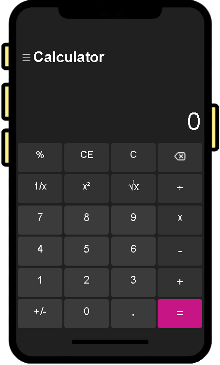

# Simple Calculator
This project is a simple calculator implemented using HTML, CSS, and JavaScript.

# Description
This calculator provides basic arithmetic operations such as addition, subtraction, multiplication, and division. It offers a user-friendly interface for performing calculations quickly and efficiently.

# Features
- Addition, subtraction, multiplication, and division operations.
- Clear button to reset the calculator.
- Responsive design for seamless usage across devices.

# Usage
- To use the calculator, simply open the index.html file in a web browser. Enter the numbers and click on the corresponding operation button to perform calculations. Use the clear button to reset the calculator.

# Screenshots

  

